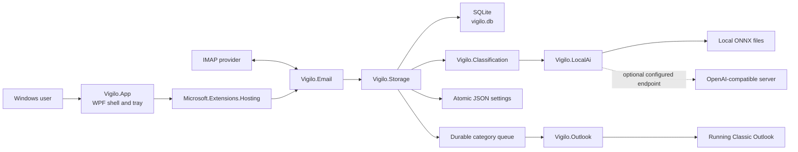
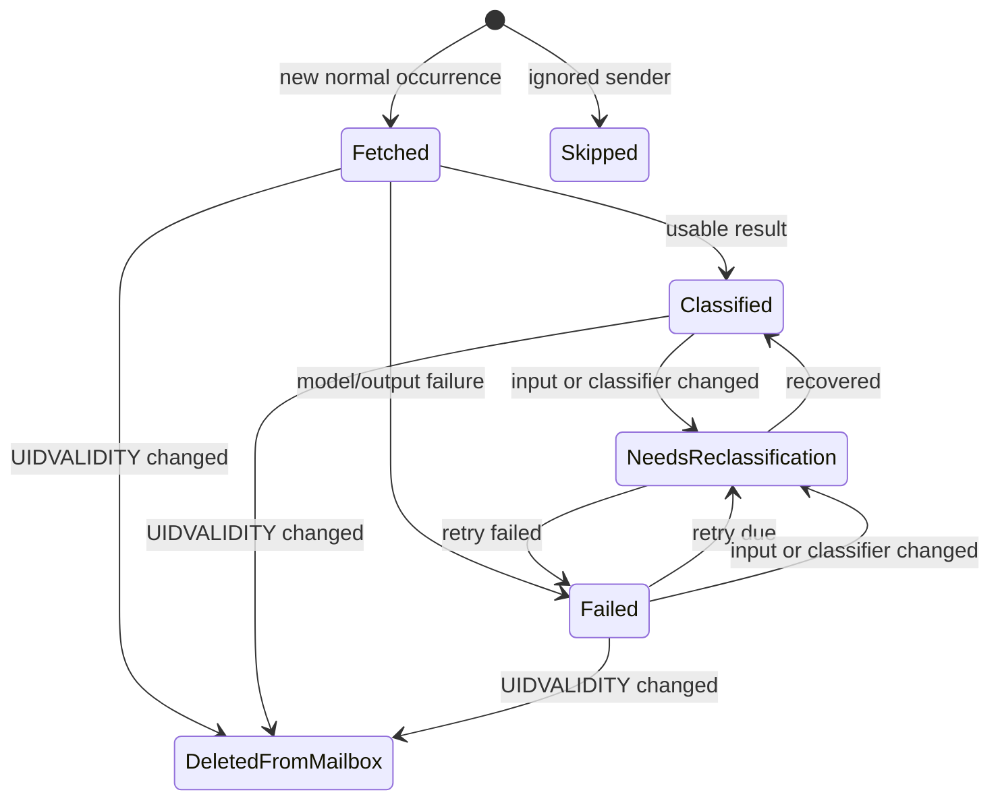
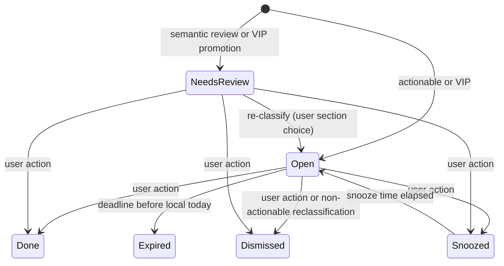
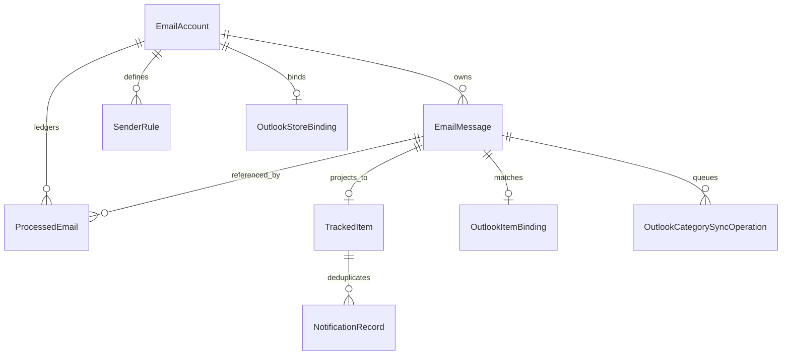
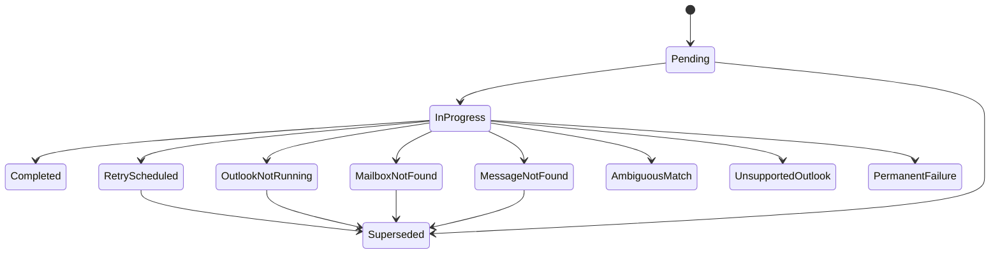

# Vigilo Design Document

## 1. Purpose

This document explains how the current Vigilo implementation is designed: its architectural boundaries, runtime topology, state models, persistence rules, concurrency choices, failure handling, privacy boundaries, and important trade-offs. It is descriptive rather than aspirational. Proposed redesigns and roadmap ideas are intentionally excluded.

The root [README](README.md) is the product landing page; [getting started](docs/getting-started.md), [local model setup](docs/local-model-setup.md), [Outlook setup](docs/outlook.md), and [development](docs/development.md) contain operational instructions. This document is the current-state architecture reference. Project-level READMEs record module scope and append-only technical decisions: dated entries are historical and may describe superseded behavior. Preserve those entries in this working repository. If a public export omits history, retain useful rationale as concise current decisions in the architecture or module scope rather than deleting it.

## 2. Design drivers

The implementation is shaped by six primary concerns:

1. **Local-first classification.** The supported AI paths process message content on the user's Windows computer.
2. **Durable idempotency.** IMAP messages must not be repeatedly classified on every scan or application restart.
3. **Conservative workflow extraction.** The system distinguishes concrete unfinished obligations from generic importance, promotions, receipts, and informational mail.
4. **Failure isolation.** Mailbox, model, UI, and Classic Outlook failures should not collapse unrelated parts of the application.
5. **Recoverable local state.** SQLite and file-based settings must not be left at incompatible generations after a crash.
6. **One workflow projection.** The same tracked-item section classifier drives the dashboard and optional Outlook categories.

## 3. System context

Vigilo is a single-user Windows desktop application. It reads messages from existing IMAP providers, stores mailbox-derived data locally, invokes a selected local or OpenAI-compatible model, and optionally writes categories into an already-running Classic Outlook instance.



There is no central Vigilo service and no Vigilo cloud account. The application, database, model runtime, scheduler, and UI all run in one desktop process, except when a configured OpenAI-compatible model server runs as a separate process or endpoint.

## 4. Solution structure and dependency direction

| Project | Responsibility | Principal dependencies |
|---|---|---|
| `Vigilo.Core` | Domain entities, records, enums, options, and service contracts. | None of the feature projects. |
| `Vigilo.Configuration` | Versioned, validated, serialized, atomic file access and snapshots. | .NET runtime only. |
| `Vigilo.Email` | IMAP transport, scanning, message extraction, IDLE/poll scheduling, progress, and manual-scan queue. | Core, Classification, MailKit. |
| `Vigilo.Classification` | MIME-content normalization, single-verdict prompt, model-response repair, validation, and classification policy. | Core, AngleSharp, JSON repair. |
| `Vigilo.LocalAi` | Model profiles, selection, installation, integrity, runtime supervision, and inference adapters. | Core, Configuration, ONNX Runtime GenAI, HTTP. |
| `Vigilo.Storage` | EF Core/SQLite mapping, migrations, settings coordination, processing ledger, tracked workflows, sender rules, reports, retention, sent replies, and Outlook queue. | Core, Configuration, EF Core SQLite. |
| `Vigilo.Outlook` | Classic Outlook COM discovery, matching, category writes, dedicated STA dispatch, and queue worker. | Core and late-bound COM. |
| `Vigilo.App` | WPF composition root, windows, view model, tray lifecycle, user approvals, notifications, and logging. | Every production module. |
| `Vigilo.Tests` | Deterministic unit and integration-style coverage, mainly using in-memory SQLite and fakes. | Production libraries needed by each test seam. |

`Vigilo.Core` defines the vocabulary used across module boundaries. Feature projects depend inward on Core contracts. `Vigilo.App` is the only composition root and therefore has the broadest dependency set.

## 5. Runtime composition and lifecycle

### 5.1 Process startup

`Vigilo.App.App` owns process startup.

1. Command-line arguments are parsed; `--background` suppresses the initial main window.
2. An explicit AppUserModelID is applied for consistent taskbar identity and icon behavior.
3. A named per-user mutex enforces a single application instance.
4. A second foreground launch signals a named activation event in the first instance, then exits. A second background launch exits silently.
5. `%LOCALAPPDATA%\Vigilo` and the current run log are prepared.
6. A Generic Host is built with JSON configuration, local logging, EF Core, feature modules, hosted services, and WPF services.
7. All `IAppBootstrapper` implementations run before the host starts. At present these initialize/validate storage and reconcile an interrupted settings transaction.
8. Hosted services start: local-AI runtime supervision, email monitoring, and Outlook category synchronization.
9. The tray icon initializes. The main window is shown for a normal launch or left hidden for `--background`.

Startup failure is logged through both the configured logger and a fallback file path, after which the WPF application exits with `-1`.

### 5.2 Single-instance and window lifecycle

The tray service owns the long-lived `MainWindow` instance. Closing that window hides it unless the user explicitly selects Exit. Reopening activates the existing window rather than creating another. The window view model is initialized once when the window is first created.

The process lifetime is therefore the tray lifetime, not the main-window lifetime.

### 5.3 Dependency injection lifetimes

- Storage and workflow services using `VigiloDbContext` are scoped.
- The scan queue, progress notifier, model options/selection/runtime, tray service, Outlook client, Outlook STA dispatcher, and in-memory log store are singleton services.
- Hosted background services create scopes for database-backed work.
- Windows and view models are transient, although the tray service retains the first main window it resolves.

## 6. Primary email-processing flow

```mermaid
sequenceDiagram
    participant Monitor as EmailMonitorService
    participant Scanner as ImapEmailScanner
    participant Ledger as EmailProcessingService
    participant Classifier as HarnessMessageClassifier
    participant Harness as EmailAnalysisHarness
    participant Model as ILocalAiClient
    participant Report as LiveReportService
    participant Notify as WpfNotificationService
    participant Outlook as OutlookSyncStore

    Monitor->>Scanner: ScanAsync()
    Scanner->>Ledger: RetryDeferredClassificationsAsync()
    loop Each usable account and folder
        Scanner->>Scanner: Connect, authenticate, open read-only
        Scanner->>Ledger: Get known UIDVALIDITY and highest UID
        Scanner->>Scanner: Search last month and fetch newer UIDs
        loop Each fetched message
            Scanner->>Ledger: ProcessFetchedEmailAsync(fetched)
            Ledger->>Ledger: Apply sender rule and ledger gate
            alt Ignored sender
                Ledger->>Ledger: Write minimal Skipped ledger row
            else New, changed, classifier changed, or retry due
                Ledger->>Classifier: ClassifyAsync(stored message)
                Classifier->>Harness: Analyze immutable labelled context
                Harness->>Model: One thinking-mode verdict call; conditional repair
                Model-->>Harness: Typed JSON verdict plus source quotes
                Harness-->>Classifier: Evidence-validated policy result and safe trace
                Classifier-->>Ledger: Normalized result or technical fallback
                Ledger->>Ledger: Create/update/dismiss tracked item
                Ledger->>Notify: Send deduplicated notification(s)
                Ledger->>Outlook: Enqueue latest section if enabled
                Ledger->>Report: NotifyChanged()
            else Flags only or unchanged
                Ledger->>Ledger: Update ledger timestamps/hashes
            end
        end
    end
    Monitor->>Monitor: Detect sent replies and apply retention
```

The processing service is the orchestration boundary between transport, classification, workflow state, notifications, reports, and Outlook projection. The IMAP scanner does not make task-policy decisions itself.

## 7. Email monitoring and scheduling design

### 7.1 Background loop

`EmailMonitorService` is a hosted `BackgroundService`. Each loop:

1. Creates a service scope.
2. Drains queued manual scans.
3. Loads usable accounts.
4. Runs a scheduled scan unless a queued scan already satisfied that iteration.
5. Detects sent replies and applies retention after scheduled work.
6. Waits for either a manual request, IMAP IDLE activity, or the polling fallback.

An unexpected loop-level exception is logged and retried after one minute. Application cancellation exits the loop immediately.

### 7.2 Manual scan queue

Manual requests enter an unbounded `Channel<QueuedEmailScan>` configured with a single reader. A request owns:

- its progress callback,
- a linked cancellation source,
- a run-continuations-asynchronously completion source.

This serializes manual scans with monitor work and prevents UI commands from starting independent concurrent mailbox traversals.

### 7.3 Account failure isolation

A full scan processes accounts sequentially. Authentication failure produces one failed count for that account. Other non-cancellation exceptions are logged and also contribute one failed count, after which scanning continues with the next account. Caller cancellation is deliberately not isolated and stops the full scan.

### 7.4 IMAP connection behavior

- Account scans skip incomplete email/username settings and accounts without a decryptable password.
- Connection and authentication each have a 60-second timeout.
- One authenticated `ImapClient` scans the de-duplicated configured inbox and sent-folder list.
- Folders are opened read-only.
- Unavailable folders are reported and skipped.
- IDLE listens only on the first monitored folder. Full scans still cover every configured folder.
- If an active IDLE connection fails, the monitor waits five seconds, scans the account folder, and creates a fresh authenticated IDLE connection.

### 7.5 UID discovery

The durable IMAP cursor is the maximum known UID for `(account, folder, UIDVALIDITY)`. A folder scan searches messages delivered after one month before the current time, then selects only UIDs greater than that cursor.

When UIDVALIDITY changes, all ledger entries for older UIDVALIDITY values in the folder are marked `DeletedFromMailbox`. The new namespace then starts with its own cursor.

This is an incremental recent-mail design, not a complete historical synchronization design. Unseen messages older than the one-month search window are not backfilled by normal scanning.

## 8. Message identity, extraction, and normalization

### 8.1 Identities

The design uses several identities for different purposes:

| Identity | Purpose |
|---|---|
| Account + folder + UIDVALIDITY + UID | One concrete IMAP occurrence and the ledger uniqueness boundary. |
| Account + provider message ID | One locally stored logical message. |
| RFC Message-ID | Cross-folder and cross-client message correlation when present. |
| Thread key | Conversation-level tracked-item reuse and sent-reply matching. |
| Subject/body/flags hashes | Change detection and final visible deduplication fallback. |

Thread keys are derived from references, `In-Reply-To`, message ID, or normalized subject. Subject normalization removes common reply/forward prefixes.

### 8.2 Extracted message content

The scanner records sender identity, subject, received time, provider/RFC IDs, text and HTML alternatives, normalized classifier payload, reply/reference headers, thread key, attachment presence, read state, flags, and scan time.

Attachment contents are never read for classification. Only filename, MIME type, size when available, and inline status are summarized.

### 8.3 Normalization pipeline

`EmailContentNormalizer` produces a deterministic `NormalizedEmailContent` object.

- A complete plain-text alternative is preferred.
- Suspiciously short plain text falls back to HTML-derived text.
- HTML parsing disables scripting and removes scripts, styles, tracking pixels, hidden elements, invisible preheaders/filler, CSS rules, and layout noise.
- Visible order, table structure, Unicode, entities, and meaningful action text are preserved.
- Current content is separated from recognizable quoted conversation.
- Links are classified, normalized, de-tracked where possible, capped at 25, and represented by visible text and useful destination-domain evidence.
- Malformed HTML and malformed links generate warnings instead of failing message processing.

The stored classifier payload has explicit metadata, body, important-links, attachments, previous-conversation, and warning sections. Its default limit is 12,000 characters. The single-verdict classifier consumes a model-aware budgeted subset of the stored body and history rather than the full payload.

## 9. Classification design

Production classification uses the single-verdict thinking-mode harness documented in [`docs/architecture/llm-harness.md`](docs/architecture/llm-harness.md). `HarnessMessageClassifier` adapts its result to the stable Core contract. There is one classification architecture and no alternate production policy path.

### 9.1 Context and single verdict call

`EmailAnalysisContextFactory` creates one immutable, deterministically budgeted set of labelled subject, current-body, quoted-history, and metadata segments. It includes mailbox identity, aliases, bounded recipient roles, reference time, timezone, a canonical hash, and truncation state. The classifier sees the whole representation in one call and treats email instructions as untrusted data.

`SingleVerdictClassifier` executes one structured model call with thinking enabled (bounded effort and token budget) through one serialized local runtime. The prompt's six ordered decision stages discipline the model's sequential planning, and the response is one trinary JSON verdict for obligation, reply, escalation, and deadline.

### 9.2 Typed verdict and evidence

The prompt is a semantically versioned embedded Markdown asset pair (shared preamble plus decision procedure with worked examples). Outcomes distinguish valid, uncertain, invalid, timeout, cancellation, runtime failure, and exhausted budget. Numeric model confidence is not used.

Model evidence supplies a segment ID, short verbatim quote, role, and optional occurrence. `EvidenceLocator` applies Unicode/whitespace canonicalization, requires an exact unique match, and derives authoritative source spans. Every positive verdict requires primary evidence from current content or subject; quoted history and metadata can only support them.

Deadline validation additionally requires an evidenced source expression appearing verbatim inside an evidence quote, a confirmed obligation, a structurally valid normalized timestamp, and rejection of the email metadata timestamp as a deadline.

### 9.3 Policy and recovery

`HarnessPolicy` is the only final decision table. It tracks a concrete unresolved recipient obligation, a genuinely required reply, or an unresolved recipient-relevant escalation. A deadline is attached only when it constrains a positive obligation. Material semantic uncertainty uses Needs Review; technical failure after the bounded repair returns an unavailable result for Storage's deferred retry schedule.

The default global budget is two model calls: one verdict call and at most one structured-output repair. Per-call and per-email timeouts are configurable, caller cancellation propagates, and negative answers are not retried merely because they are negative.

### 9.4 Cache, trace, and evaluation

Validated responses are cached in bounded process memory and a persistent file beside the local database. Keys include context hash, model identity including thinking mode, prompt version, and call dependency. Invalid responses are never cached.

`HarnessTrace` records safe hashes, versions, verdict status, failure code, call counts, cache state, and policy path without source content. `HarnessEvaluationRunner` consumes sanitized JSONL through the same production interfaces and reports per-dimension confusion counts, precision, recall, F1, latency percentiles, model-call cost, and version metadata.

## 10. Local AI design

### 10.1 Model profiles

`ModelProfileCatalog` contains four profiles:

| Preset | Backend | Deployment |
|---|---|---|
| Phi4Mini | ONNX Runtime GenAI | Default in-process CPU int4 model. |
| Phi4Full | ONNX Runtime GenAI | Larger in-process CPU int4 model. |
| Gemma4E2BLiteRt | OpenAI-compatible HTTP | LiteRT-LM `gemma4-e2b`, lower-memory profile. |
| Gemma4E4BLiteRt | OpenAI-compatible HTTP | LiteRT-LM `gemma4-e4b`, higher-resource profile. |

The selected preset is stored in schema-versioned `model-settings.json`. A selection write completes before shared in-memory `ModelOptions` are changed.

### 10.2 ONNX model installation and integrity

ONNX profiles require eight model/tokenizer files beneath `%LOCALAPPDATA%\Vigilo\Models\<version>` plus `vigilo-model-state.json`.

Download/repair:

- requires explicit WPF approval,
- performs HEAD metadata checks,
- accepts trusted SHA-256 or Git-blob SHA-1 source identifiers,
- skips an existing file only when size and digest match,
- downloads to `.download`,
- reports byte-based progress,
- validates before atomic move to the final name,
- records local SHA-256 values,
- removes temporary files on success, failure, or cancellation.

Model status re-hashes files whenever the saved integrity-state signature changes. The verified signature is cached to avoid hashing multi-gigabyte files on every status request.

### 10.3 Inference runtime

ONNX models load lazily and the first load is serialized. Both ONNX and HTTP adapters receive the same role-tagged conversation and use the selected profile's bounded output allowance.

OpenAI-compatible profiles default to `http://localhost:9379/v1` and are required to use a loopback endpoint. The runtime supervisor can reuse a healthy local server or start a configured executable in a hidden window. It serializes readiness work, tracks process ownership, retries with bounded backoff, and stops only a process it started.

## 11. Processing ledger and workflow design

### 11.1 Ledger gate

`ProcessedEmail` is the durable idempotency record. A fetched occurrence is classified when:

- no ledger row exists,
- subject or body hash changed,
- classifier version changed,
- or a deferred retry is due.

A flags-only change updates the flags hash and report notification without invoking the classifier. An unchanged occurrence updates `LastSeenAt` only.

Production registers `IClassificationVersionSource` as `ClassificationVersionSource` in `AddVigiloClassification`. Its ledger version is `EmailAnalysisHarness.CurrentVersion + "+" + IPromptRegistry.CompositeVersion`; its prompt version is the registry composite. `EmbeddedPromptRegistry` hashes the assembled common preamble and verdict prompt contents, and each prompt also carries its declared header version plus a content hash. Prompt edits therefore make existing ledger classifications eligible for reclassification on a subsequent processing pass without a manual static-version bump. This is eligibility, not an immediate rescan of every stored message.

`ClassificationMetadata.CurrentVersion` and `CurrentPromptVersion` are compatibility fallbacks for compositions without an injected version source. Changing only those constants does not advance the production ledger version. For policy or other non-prompt behavior changes that must invalidate stored classifications, advance `EmailAnalysisHarness.CurrentVersion` as well as the relevant semantic policy version and verify ledger reclassification behavior. Content-derived versions prevent a forgotten manual bump from silently preserving results from an older prompt; harness versioning covers behavior outside those assets.

### 11.2 Processing state



`New` remains in the enum for compatibility but current new processing rows are initialized as `Fetched`. A UIDVALIDITY change marks every prior ledger state for that account/folder namespace as `DeletedFromMailbox`; the diagram shows only the common incoming transitions.

### 11.3 Deferred classification

Technical failure metadata includes attempt count, next attempt time, failure kind, recovery kind, and error message. Retry delays are:

| Consecutive failure | Next automatic attempt |
|---:|---|
| 1 | 5 minutes |
| 2 | 30 minutes |
| 3 | 2 hours |
| 4 | No automatic retry |

Due rows are retried from the stored `EmailMessage` before a mailbox scan discovers new UIDs. If the stored message is missing, the attempt count is set to the limit and the row is marked `MissingStoredMessage`. Changed input or classifier metadata resets the retry state.

## 12. Sender-rule design

Sender addresses are canonicalized with `MailAddress` and compared through uppercase normalized values. The database enforces one rule per account and normalized sender.

### 12.1 Ignored sender

Ignored rules are applied before message upsert and classification. The system writes only a minimal `ProcessedEmail` row with status Skipped and no `EmailMessageId`. This is both a performance optimization and a privacy boundary: ignored bodies are not retained or passed to the model.

### 12.2 VIP sender

VIP messages are always tracked.

- A non-actionable VIP result is forced into visible work.
- A VIP promotion is routed to Needs review rather than Commercial offers.
- A VIP message remains visible when classification is unavailable; its reason explains the technical failure.
- Other usable VIP workflow signals remain available to the normal section classifier.

## 13. Tracked-item design

### 13.1 Creation and reuse

A tracked item is created for an actionable result, semantic Needs Review result, promotion, or VIP message. The database enforces one tracked item per stored message.

Before creation, visible deduplication searches globally in this order:

1. equal non-empty RFC Message-ID,
2. equal non-empty thread key,
3. equal sender plus SHA-256 of uppercased trimmed subject and normalized body on the same received calendar day.

Done and Dismissed items are excluded. The current deduplication queries are not account-scoped, so equivalent identifiers can reuse a visible item across accounts.

When reusing an item, reply and escalation values are OR-merged, a new deadline replaces only when present, and new non-empty summary/reason values replace old text. The original tracked item's `EmailMessageId` remains the visible anchor.

If a visible item is later reclassified as non-actionable, it is Dismissed and its deadline, reply, and escalation fields are cleared.

### 13.2 User state



The generic Snooze command uses one day; `SnoozeAsync` also supports an explicit time. The current UI exposes Done, Dismiss, and Snooze transitions plus re-classification of Needs review items into Due today, Upcoming, Waiting for my reply, or Commercial offers, but no dedicated reopen command, although the report service can programmatically set a status back to Open. Sent-reply detection annotates an item but intentionally does not complete it.

A re-classification sets the tracked item's `Status` to Open and records the chosen section in `SectionOverride`, which wins over every derived rule in `TrackedItemCategories.Classify` and therefore drives the UI section and the Outlook category. The override survives later classifier re-runs of the same message. Snoozing clears it, and the item then derives its section from the remaining state again.

### 13.3 Exclusive section projection

`TrackedItemCategories.Classify` is the single section authority for the UI and Outlook.

| Precedence | Section | Condition |
|---:|---|---|
| 1 | Done | Status Done. |
| 2 | Dismissed | Status Dismissed. |
| 3 | User override | Non-empty `SectionOverride` recorded by a user re-classification. |
| 4 | Needs review | Status NeedsReview. |
| 5 | Commercial offers | Message type Promotion. |
| 6 | Waiting for my reply | Required-reply flag. |
| 7 | Due today | Deadline is local today or earlier (overdue included). |
| 8 | Snoozed | Status Snoozed. |
| 9 | Upcoming | Fallback: deadline in the future or absent. |

Escalation never determines the section: `IsEscalation` is rendered as a red badge on the row and counted by the Escalations summary metric (a flag count that intentionally overlaps the section counts), so an escalation due today still shows in Due today. An item whose deadline has passed is likewise not a separate section: overdue rows group into Due today and carry a red expired presentation state on the view (never on Commercial offers rows, whose deadlines are informational offer expiries).

The list orders sections by urgency: Due today, Waiting for my reply, Needs review, Upcoming, Commercial offers, Snoozed, Dismissed, Done. Items inside a section are sorted by increasing deadline first (expired and earliest first, undated last) and then by source-message received time descending.

Because promotion is evaluated before reply, due, and snooze, a promotion can only reach those sections if another rule changes its message type/status; normal promotion processing clears workflow signals.

## 14. Live reports, details, and sent replies

### 14.1 Live report

`LiveReportService` calculates current counts directly from tracked state rather than relying on persisted report snapshots. It first applies elapsed snooze and expired-deadline transitions, then classifies active items through the shared section function.

The all-time processed count is the number of ledger rows. `LastMessageProcessedAt` is the maximum ledger processing timestamp. `LiveReportChangeNotifier` is a singleton fan-out so changes made through one scoped report-service instance refresh subscribers attached through another.

The `LiveReport` database entity remains for compatibility, but the current dashboard is a live query and digest snapshots have been removed.

### 14.2 Message details

The detail query combines tracked state, stored message content, account identity, latest related ledger row, sender rule, and latest non-superseded Outlook operation. It returns structured data to the UI rather than requiring the UI to parse a diagnostic export.

The clipboard export intentionally includes substantial local diagnostic context: tracked fields, message metadata, non-secret account configuration, ledger fields, and normalized body. Passwords are never included.

### 14.3 Sent-reply detection

After scheduled scans, `SentReplyDetectionService` examines Open, Snoozed, and NeedsReview items without an existing reply annotation. It stays inside the originating account and considers sent-folder messages at or after the original receive time.

Matching accepts equal thread key, `In-Reply-To`/References containing the original RFC Message-ID, or equal normalized subject. A match records reply time and reply ID but leaves task completion to the user.

## 15. Notifications

The processing service requests three notification kinds:

- New actionable item,
- Deadline due today,
- Possible escalation.

Commercial offers do not request actionable notifications. Notifications are also suppressed when the account no longer exists or has notifications disabled.

`WpfNotificationService` persists a unique `(TrackedItemId, Kind, DedupeKey)` record before showing a tray balloon. Dedupe keys use:

- tracked-item update time for a new item,
- deadline date for a due-today alert,
- escalation boolean for escalation.

The tray displays a six-second informational balloon containing action summary and subject. Delivery is best-effort after the dedupe row commits; there is no notification outbox or delivery acknowledgement.

## 16. Retention and deletion

Retention runs per account and also applies workflow-specific limits.

| Data | Deletion rule |
|---|---|
| General stored messages | Received before `UtcNow - DataRetentionDays` (minimum one effective day). |
| Commercial offers | Seven days after message receipt. |
| Dismissed items | When the source message is more than seven days old. |
| Done items | One month after `CompletedAt`, or `UpdatedAt` if completion time is absent. |
| Snoozed items | Not deleted for snooze alone; elapsed snoozes reopen first. |

Message deletion explicitly removes linked notification records, Outlook work/bindings, tracked items, and processing rows before the message itself. Database cascade rules provide an additional relational safety net.

Retained messages keep normalized, original text, and original HTML bodies. `StoreMessageBodies` remains true as a legacy schema-compatibility field; metadata-only retention is no longer active.

Delete all local email data removes Outlook operations/item bindings, notifications, tracked items, ledger rows, messages, and legacy live reports. It keeps accounts and protected passwords. Deleting an account removes that account's complete local graph and password.

## 17. Settings consistency design

### 17.1 Storage split

Settings span three stores:

- account and Outlook binding in SQLite,
- DPAPI-protected passwords in `protected-settings.json`,
- selected model preset in `model-settings.json`.

`SettingsCoordinator` makes one save recoverable across those stores.

### 17.2 Save protocol

1. Validate account, binding, model preset, and new password before mutation.
2. Acquire a process-wide save semaphore.
3. Recover any previous incomplete settings transaction.
4. Capture checksummed snapshots of both JSON files.
5. Atomically write `settings-transaction.json` with a new transaction ID and snapshots.
6. Begin a SQLite transaction.
7. Save account and optional Outlook binding.
8. Insert the transaction ID into `SettingsConfigurationCommits` inside the same SQLite transaction.
9. Atomically write changed model/password documents.
10. Commit SQLite.
11. Reconcile and remove the journal.

If a failure occurs before commit, SQLite rolls back and recovery restores both file snapshots. If startup finds the commit marker, it concludes that the new generation committed and keeps the files. If no marker exists, it restores the previous generation.

Journal snapshots include path, existence, bytes, and SHA-256. Recovery rejects unexpected paths, invalid hashes, missing-file snapshots with content, unsupported schema versions, and incomplete identities.

### 17.3 Atomic configuration repository

Each configuration document declares its current version, default factory, version accessor, migration function, and validator. Reads migrate known legacy shape and reject future versions. Writes validate before atomic replacement. A per-path gate serializes concurrent updates. Snapshots can restore prior content or remove a file that did not previously exist.

## 18. Persistence model

### 18.1 Local files

| Location under `%LOCALAPPDATA%\Vigilo` | Contents |
|---|---|
| `vigilo.db` | Accounts, stored messages, ledger, tracked workflow, notifications, sender rules, Outlook state, migration history, and settings commit markers. |
| `protected-settings.json` | Schema v1 map of account ID to DPAPI CurrentUser ciphertext. |
| `model-settings.json` | Schema v1 selected model preset. |
| `settings-transaction.json` | Temporary cross-store recovery journal. |
| `Models\<version>` | ONNX model files and integrity state. |
| `logs\vigilo-*.log` | Per-run logs. |
| `logs\latest-run.txt` | Latest-run log marker. |
| `llm-exchanges` | Debug-only full prompt/response diagnostics. |

### 18.2 Relational model



Important uniqueness constraints:

- `ProcessedEmail(AccountId, Folder, UidValidity, ImapUid)`
- `EmailMessage(AccountId, ProviderMessageId)`
- `TrackedItem(EmailMessageId)`
- `NotificationRecord(TrackedItemId, Kind, DedupeKey)`
- `SenderRule(AccountId, NormalizedSenderEmail)`
- `OutlookStoreBinding(VigiloMailboxId)`

All account/message workflow relationships use cascade delete in the current relational model.

### 18.3 Schema bootstrap

The EF migration history is a single squashed baseline migration, `20260908104704_Baseline`, generated from the current model and declared by `VigiloDatabaseSchema.CurrentMigration` in [AppBootstrapper.cs](src/Vigilo.Storage/AppBootstrapper.cs). It creates the complete schema in one step, including the cascade foreign keys and `TrackedItem.SectionOverride`, so a manual section choice survives later classifier runs.

Startup:

1. validates the compiled migration set,
2. validates that applied history is a known ordered prefix,
3. rejects databases that contain tables without migration history,
4. applies the baseline migration to an empty database,
5. verifies required tables and indexes,
6. verifies required cascade foreign keys,
7. executes SQLite foreign-key integrity validation.

Unknown/newer or out-of-order schema history stops startup without attempting an opportunistic repair.

## 19. Classic Outlook integration

### 19.1 Boundary and non-blocking behavior

The integration supports only Classic Outlook for Windows and is disabled by default. Vigilo never starts Outlook. The email-processing transaction persists desired category work; a separate worker attempts COM changes later. Outlook closure, busy state, unsupported installation, or transient COM failure therefore does not fail classification.

COM work is serialized on a dedicated background STA thread. COM objects are created, used, and explicitly released inside that dispatcher.

### 19.2 Shared category projection

`OutlookCategoryMapper` maps a tracked item to a set containing exactly one value from `TrackedItemCategories.Classify`. Existing unrelated categories are preserved. Exact current and legacy Vigilo names are treated as managed and replaced; similar names remain untouched.

Missing current categories are created with stable default colors. Existing categories retain their user-selected colors.

### 19.3 Message matching

Lookup is deliberately conservative:

1. Validate saved EntryID and StoreID, mail class, and RFC Message-ID when available.
2. Search the configured Inbox with a MAPI restriction on normalized RFC Message-ID and inspect at most 50 candidates.
3. Sort Inbox items by received time descending and inspect at most 500 candidates.
4. Without decisive Message-ID evidence, require a receive-time difference no greater than 15 minutes, equal sender address, and exact subject.

The match policy accepts exactly one candidate. Multiple candidates return Ambiguous and no item is modified.

### 19.4 Durable queue

Enqueueing normalizes desired categories. An equal active operation is reused. If no active work exists, an equal completed state suppresses redundant work unless a force/backfill operation was requested. Any older active operations are marked Superseded before the new Pending operation is inserted.



The worker runs immediately and every 30 seconds, taking at most 20 due operations. InProgress work older than ten minutes is recovered to RetryScheduled at startup. Retry backoff is `2^attempt` minutes capped at six hours; normal retryable work stops after eight attempts. Outlook-not-running operations remain retryable on a two-minute schedule without consuming attempts because connection probing happens before MarkInProgress.

Persisted error messages are sanitized and capped at 500 characters. Diagnostics report connection/store/queue state without message bodies or prompt content.

## 20. Desktop UI design

### 20.1 Main window

The WPF main window is a monitoring dashboard. `MainWindowViewModel` exposes:

- grouped tracked items and section counts,
- all-time processed count and latest processed time,
- manual scan command and detailed scan progress,
- tracked-item Done, Dismiss, Snooze, View, and Reply/Open commands, plus a Re-classify submenu on Needs review rows offering Due today, Upcoming, Waiting for my reply, and Commercial offers,
- model status and installation commands,
- retention and local-data deletion commands,
- current run log text.

The tracked collection uses a WPF `ICollectionView` grouped by the precomputed section name. Summary cards navigate to their corresponding sections, and users can select the visible tracked-message columns for the current session.

### 20.2 Settings window

The modal `SettingsWindow.xaml` and its code-behind own account selection/editing, IMAP presets, polling/IDLE/notifications/retention, password replacement, model profile selection, sender rules, and Classic Outlook configuration. The password box is cleared when the selected account changes and after a successful save; saved password material is never read back into the UI. Settings and the dashboard share `MainWindowViewModel`; account/provider UI changes belong in Settings, while `MainWindow.xaml` owns the monitoring dashboard.

### 20.3 Tracked-message window

The detail window prefers original HTML and otherwise shows original plain text. If neither was stored, it displays an explicit unavailable message.

The embedded browser removes link/base `target` attributes. Navigation outside `about:` is canceled and only absolute HTTP, HTTPS, or `mailto:` URIs are handed to Windows. Reply creates a `mailto:` URI to the sender and prepends `Re:` if necessary; it does not open the original provider message.

### 20.4 Async commands

`AsyncRelayCommand` prevents reentry while executing, refreshes `CanExecute`, logs duration and failure, and always returns to the enabled state. It catches command exceptions after logging, so individual command failures do not escape through WPF's async-void event boundary.

## 21. Concurrency and consistency model

| Concern | Current serialization/consistency mechanism |
|---|---|
| Application instance | Named Windows mutex and activation event. |
| Manual mailbox scans | Single-reader channel consumed by the monitor. |
| Account scans | Sequential within one full scan. |
| Settings save | Static `SemaphoreSlim` plus SQLite transaction and recovery journal. |
| Configuration files | Per-path repository gates and atomic replacement. |
| Model selection | Instance `SemaphoreSlim`; persist before mutating shared options. |
| First ONNX model load | Lazy initialization guarded by a semaphore. |
| Runtime readiness/start | Runtime-supervisor serialization. |
| Outlook COM | Dedicated single STA dispatcher queue. |
| Outlook desired state | Durable superseding operation records. |
| UI commands | Per-command reentry guard. |
| Cross-scope report refresh | Singleton change notifier. |

Classification and tracked-state updates use scoped EF Core operations, but the full processing path is not wrapped in one explicit transaction spanning model call, notification record, and Outlook queue. EF `SaveChanges` calls provide local atomic batches. Notifications are best-effort, while Outlook uses a durable queue.

## 22. Privacy and security design

### 22.1 Local-processing promise

For the supported ONNX and local OpenAI-compatible profiles, MIME normalization, prompt construction, model inference, deadline validation, summaries, reasons, and workflow storage occur locally. Network access consists of IMAP provider access and explicit model download/runtime endpoints.

The supported OpenAI-compatible configuration is loopback-only. `OnnxGenAiClient.CompleteOpenAiCompatibleAsync` checks that the configured initial endpoint is an absolute URI satisfying `Uri.IsLoopback`, and rejects it before sending a prompt if it fails. This is an initial-URI check: the client creates a default `HttpClientHandler` and does not explicitly disable redirects or revalidate redirect destinations. The check also cannot prevent a local server from forwarding content elsewhere; the configured server must perform inference locally.

### 22.2 Credential protection

Mailbox app passwords are excluded from SQLite. `AccountSettingsService` encrypts UTF-8 password bytes with Windows DPAPI `CurrentUser` and stores Base64 ciphertext keyed by account ID. Loading validates Base64 and, on Windows, verifies decryptability. A different Windows account or machine cannot normally decrypt the document.

The settings UI exposes only saved/not-saved status and clears input after save. Logs and clipboard diagnostics do not include passwords.

### 22.3 Content exposure surfaces

Mailbox content is intentionally present in:

- SQLite normalized/original body columns,
- the tracked-message detail and clipboard export,
- release run logs only where a log statement includes derived metadata, not full prompt content,
- debug-only LLM exchange files, which contain complete prompts and responses,
- the configured local OpenAI-compatible server (subject to the initial-URI boundary in section 22.1).

Ignored-sender rules avoid the first three storage/classification surfaces for newly processed ignored messages, leaving only minimal ledger metadata.

### 22.4 Outlook safety boundary

Outlook integration reads only identity/category information needed to match and update the configured Inbox item. It does not read bodies or attachments through COM, start Outlook, send mail, move messages, set flags/reminders, create folders/rules, or request cloud authorization.

## 23. Failure handling

| Failure | Current behavior |
|---|---|
| Incomplete account or missing password | Account scan is skipped and progress explains why. |
| IMAP connection/auth timeout | Operation ends after 60 seconds; account failure is isolated. |
| Authentication rejected | Account contributes one failed scan result; later accounts continue. |
| Folder unavailable | Folder is skipped; remaining folders continue. |
| UIDVALIDITY changed | Prior folder ledger rows are marked stale/deleted and new UID namespace proceeds. |
| Model missing or inference fails | Failed ledger result, stored retry schedule, no normal tracked item. |
| Model output malformed | Local repair, then one model review, then technical deferred failure if still unusable. |
| Settings file/database failure | Rollback plus journal-based snapshot recovery. |
| Unknown/newer database schema | Startup stops without migration. |
| Outlook not running | Classification succeeds; queued work retries later. |
| Outlook match ambiguous | Permanent ambiguous state; no Outlook item changes. |
| Outlook transient COM failure | Bounded exponential retry. |
| Tray notification display failure | No delivery acknowledgement; persisted dedupe row prevents ordinary replay. |
| Background monitor loop failure | Log and retry after one minute. |

## 24. Observability

`LocalFileLoggerProvider` writes every enabled entry to a per-run file and mirrors it to `AppLogStore` for the UI. The default configuration logs `Vigilo` at Debug, general categories at Information, Microsoft at Warning, and EF SQL commands at None.

Log files use local ISO timestamps and include category, event identity, formatted state, and exception details. Logs older than 14 days are deleted at startup; cleanup failures are ignored so they cannot prevent application launch.

Processing logs include account/folder/UID identity, local/provider message identity, shortened hashes, outcome, classifier/prompt version, retry/recovery kind, and elapsed time. A `latest-run.txt` marker points diagnostic tooling to the current run.

Debug builds can persist complete LLM exchanges under `%LOCALAPPDATA%\Vigilo\llm-exchanges` (or an environment override). Filenames include received date and a sanitized/truncated subject.

## 25. Testing design

The main suite uses xUnit on .NET 10. High-value behavior is tested at module seams with fake classifiers/clients and in-memory SQLite connections, preserving relational EF behavior without writing production files.

| Area | Test class |
|---|---|
| MIME and payload normalization | `EmailContentNormalizerTests` |
| Prompt contract, verdict parsing, repair, deadline rules, thinking request shape | `HarnessTests`, `GemmaInferenceTests` |
| Ledger, workflow, reporting, deduplication, reply detection, retention | `ProcessingLedgerTests` |
| Sender rules and ignored/VIP behavior | `SenderRuleTests` |
| Account/password settings | `AccountSettingsServiceTests` |
| Atomic files and schema versions | `AtomicConfigurationRepositoryTests` |
| Cross-store save and recovery | `SettingsCoordinatorTests` |
| IMAP timeout and account isolation | `ImapOperationTests`, `ImapEmailScannerTests` |
| Schema bootstrap, migration history rejection, cascades | `StorageBootstrapTests` |
| Outlook mapping, matching policy, retry, supersession | `OutlookIntegrationTests` |
| Runtime supervision and background launch parsing | `StartupAndRuntimeTests` |
| Real local model smoke test | `LocalModelIntegrationTests` |

The real-model test is opt-in through `VIGILO_RUN_MODEL_INTEGRATION=1`. Normal CI does not require an IMAP server, model files, network, or Classic Outlook.

## 26. Packaging and deployment

The application publishes as a self-contained, multi-file Windows x64 build. Release automation produces:

- a per-user installer with Start menu shortcut and optional default-enabled startup registration,
- a portable ZIP,
- SHA-256 checksums,
- an SBOM.

Neither package contains an AI model. Models are downloaded after explicit approval or supplied by the selected external runtime. Startup registration launches only `Vigilo.App.exe --background`.

Packages are currently unsigned. Checksums verify artifact integrity but do not establish publisher identity or suppress SmartScreen.

## 27. Current design limitations and maintenance hazards

- Normal scanning discovers only recent unseen mail within a one-month server search window.
- IDLE observes only the first monitored folder per account.
- Visible tracked-item deduplication is global rather than account-scoped and retains the original message anchor when another message reuses the item.
- Sent-reply subject matching is heuristic and may annotate related same-subject mail; it does not complete tasks.
- Inference cancellation can be normalized into a technical model-unavailable result at the classifier exception boundary.
- The full processing path is not a single explicit transaction across tracked state, notification dedupe, and Outlook enqueue.
- Notification persistence is not an outbox: a crash after the dedupe commit but before balloon display loses that notification.
- `LiveReport` remains in the data model although live counts no longer use stored report snapshots.
- The detail window uses the WPF embedded browser for original HTML and is not a full modern email-rendering sandbox.
- Original message bodies are retained for all retained messages; the legacy metadata-only setting is no longer functional.
- Generic Outlook category names cannot encode ownership. An exact matching category is treated as Vigilo-managed even if another tool or the user created it.
- Outlook search is limited to the configured Inbox.
- Debug LLM exchange logs contain complete message prompts and responses and therefore require the same local-data care as the database.
- The inference client rejects non-loopback initial URIs, but does not explicitly constrain HTTP redirects or what the local server does with received content (section 22.1).
- Local models have material disk, memory, CPU, and first-load costs.

## 28. Change-impact guide

| Change | Coupled design areas |
|---|---|
| Classification policy or schema | Prompt builder, parser, semantic validation, content-derived `IClassificationVersionSource`, harness/policy versions, classification tests, ledger reclassification behavior (section 11.1). |
| Section name or precedence | `TrackedItemCategories`, live report ordering/counts, UI grouping, Outlook mapper/managed registry/colors, Outlook tests. |
| Tracked status/state transition | Live report scheduled transitions, retention, commands, details, Outlook enqueue, migrations if persisted shape changes. |
| Account setting | Domain entity, validator, `SettingsWindow.xaml`/code-behind, shared `MainWindowViewModel`, EF mapping/migration, presets, coordinated-save journal if file stores change. |
| New inference backend | Model profile catalog, model manager/status, runtime supervisor if external, `ILocalAiClient`, privacy documentation, integration tests. |
| Database schema | `VigiloDbContext`, squashed EF baseline migration, declared current migration, integrity checks. |
| Notification channel | `INotificationService`, durable dedupe semantics, user settings, privacy/error handling. |
| Outlook category | Shared section classifier, managed/legacy registry, default color, queue idempotency, UI/report tests. |
| Retention rule | `LocalDataMaintenanceService`, cascade graph, account deletion, privacy documentation, processing-ledger tests. |

Any change to a project's scope, dependencies, runtime behavior, persistence, model behavior, or test strategy must update that project's README. Product-level architecture or behavior changes must also update the root README and this design document.
