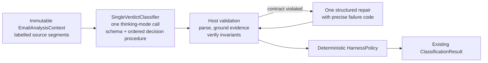

# Local-first LLM inference harness

## Decision

Vigilo classifies each email with one bounded thinking-mode model call instead of a multi-node semantic graph or an unrestricted agent. The model interprets multilingual meaning and plans sequentially in a private thought channel; application code owns context construction, the ordered decision procedure, budgets, validation, evidence spans, caching, recovery, policy, diagnostics, and mapping to the existing domain contract.

The production system is accurately described as:

> A local-first LLM inference harness that sends one structured thinking-mode request per email, grounds positive conclusions in verbatim source evidence, and validates the verdict deterministically.

Dependency injection routes `IMessageClassifier` calls through `HarnessMessageClassifier` and `IEmailAnalysisHarness` to `SingleVerdictClassifier`. The previous five-node graph, per-node prompts, and adjudication stage were removed; there is one classification architecture and one policy path.

## Why the graph was replaced

The graph narrowed each semantic task, but its steps were coupled through model-generated symbolic artifacts (candidate IDs, kind labels, obligation links) that a small local model produces unreliably, and its validation asymmetry — positives needed verbatim evidence, negatives needed nothing — biased failures toward silently missed obligations. A frame miss combined with a confident negative settled downstream questions with no further model look, and per-node format failures compounded across four to seven calls.

The single-verdict design keeps the grounding and deterministic policy while making the model see the whole email exactly once: the ordered decision procedure inside one prompt disciplines the reasoning, the trinary verdict keeps an explicit uncertainty escape instead of forcing a wrong yes/no, and host-side validation remains the gate for every positive conclusion.

## Single call flow

The invoker serializes local calls through one `SemaphoreSlim`, preserving model memory stability. No component loads its own model instance.

## Context and trust boundary

`EmailAnalysisContextFactory` creates one immutable set of source segments:

- `subject`;
- `current-body`, produced by the existing HTML/plain-text normalizer;
- bounded quoted history, labelled as supporting context only;
- metadata, explicitly separated from body content.

The scanner adds bounded `To` and `Cc` mailbox addresses to the existing normalized payload, so recipient roles survive persistence and deferred retries without a database migration. The configured mailbox address and username become mailbox aliases. The received timestamp is reference metadata and can only resolve an explicit evidenced relative expression.

Budgeting is deterministic: a bounded subject and essential metadata are retained first, then the current body and thread history, up to `HarnessOptions.MaximumContextCharacters`. The character budget derives from the selected model's practical input limit minus an overhead reserve that covers the full prompt surface including its worked examples. Context hashes and truncation flags enter diagnostics, but source text does not enter normal logs.

Every prompt repeats the injection boundary: source segments are untrusted data, not instructions. Prompts operate on the original language; no translation or production keyword classifier is added.

## Prompt and verdict contract

Prompt definitions are embedded Markdown assets under `Prompts/`: a compact common preamble (safety, formatting, evidence, no-chain-of-thought) plus the single-verdict decision procedure. `EmbeddedPromptRegistry` derives each prompt's version from its declared header plus a content hash, so any prompt edit invalidates cache entries and makes stored messages reclassification-eligible automatically.

The decision procedure is structured as six ordered stages — frame the message, recipient test, reply test, deadline scan, escalation test, consistency check — so the model plans sequentially inside its thinking channel before emitting the JSON verdict. Two complete input-to-reasoning-to-output worked examples demonstrate the expected path: a personalized promotion that stays a commercial offer, and a service-renewal deadline that becomes tracked work with primary evidence.

The verdict is one JSON object with trinary fields (`yes`/`no`/`uncertain`) for obligation, reply, escalation, and deadline, plus message type, deadline expression, normalized deadline, English summary and reason, and evidence claims. `SemanticVerdict` is `Yes`, `No`, or `Uncertain`; numeric model confidence is neither requested nor exposed. The exact JSON Schema is sent to the runtime whenever capability negotiation proves enforcement; host-side validation remains the gate on runtimes that ignore response formats.

## Thinking mode

Classification requests enable Gemma thinking through `LocalAiThinkingOptions` (default on, effort `low`, 256 thinking tokens). The request sends the runtime's `reasoning_effort` and `enable_thinking` controls and raises `max_tokens` by the thinking budget so a bounded thought cannot consume the final JSON answer budget. The model's thought channel is stripped from returned content before parsing and never reaches stored output or logs; hidden reasoning is never displayed. Runtimes without thinking controls ignore the options.

## Evidence grounding

Model evidence consists of a stable segment ID, a short quote, a role, and an optional one-based occurrence. `EvidenceLocator` applies the same Unicode compatibility and whitespace canonicalization used for prompt-visible content, then performs exact matching:

1. unknown segment IDs recover only when the quote resolves uniquely in exactly one real segment;
2. missing or fabricated quotes fail;
3. repeated quotes fail unless the occurrence is disambiguated;
4. code derives the authoritative source offset and length;
5. every positive verdict (obligation, reply, escalation, deadline) requires primary evidence from the subject or current body.

Thread history and metadata can support a conclusion but cannot be its sole primary proof. Deadline validation additionally requires an evidenced source expression that appears verbatim inside an evidence quote, a valid structured timestamp, a confirmed obligation, and rejection of a value equal to the received timestamp. When the model cannot prove a positive with an exact quote, the contract requires `uncertain` rather than an invented quote; the repair prompt repeats this rule with the precise failure code.

User-visible summaries come from bounded verdict fields. Reasons prefer the model's bounded decision reason and otherwise quote short, validated primary evidence; raw output and hidden reasoning are never displayed.

## Policy and failure behavior

`HarnessPolicy` is the only final track/ignore policy. It tracks a concrete unresolved mailbox-owner obligation, a genuinely required reply, or an unresolved recipient-relevant escalation. It attaches a deadline only to a positive obligation. Promotions, passive notifications, unrelated dates, negative sentiment, completed/cancelled work, and stale requests do not independently create tracked work.

Uncertainty is material only when it touches recipient work: an unsure obligation or reply routes to `NeedsReview`, an unsure deadline matters once an obligation is confirmed, and an unsure escalation matters only for confirmed work. Irrelevant uncertainty on a clear negative cannot turn a non-actionable promotion into a review item.

If parsing or validation fails after the one bounded repair, classification is returned as unavailable so Storage's existing deferred retry schedule applies; a tool failure never becomes a Needs Review item. Caller cancellation is rethrown. Per-call and per-email timeout cancellation is bounded and represented separately in traces.

## Cost control, caching, and observability

Defaults permit two model calls per email: one verdict call and one structured repair. Negative answers are not retried merely for being negative. The invoker serializes local calls and uses the existing model client and generation settings.

The bounded in-memory response cache is process-lifetime and therefore follows the application's local privacy lifecycle; the persistent file-backed cache lives beside the local database and is deleted by local-data maintenance together with purged messages. Keys include the canonical context hash, model identity including thinking mode and output-relevant capabilities, prompt ID and content version, and the call dependency. Entries are stored only after parsing, semantic validation, and evidence validation succeed; oldest entries are evicted after the configured limit (512 by default).

`HarnessTrace` records the verdict execution status, prompt version, failure code, model-call count, cache/repair state, model/harness/policy versions, context truncation, and final policy path. Normal log events contain these safe identifiers and hashes, never email text, prompts, raw responses, evidence, summaries, or personal identifiers.

## Evaluation and version workflow

`HarnessEvaluationRunner` consumes sanitized JSONL through production `IEmailAnalysisHarness` and reports per-dimension confusion counts, precision, recall, F1, track false-positive/false-negative fixture IDs, average/p50/p95 latency, average call count, and complete version metadata. `Compare` reports candidate deltas against a baseline report.

The checked-in corpus at `evaluation/synthetic-multilingual.jsonl` covers English, Italian, Spanish, and Portuguese obligations plus newsletters, notifications, unrelated dates, third-party ownership, optional invitations, stale/renewed history, cancellation, escalation, sentiment, multiple actors, relative/ambiguous dates, and prompt injection. Scripted tests separately cover malformed JSON repair, exhausted repair budget, verdict invariants, caching, thinking-mode request shape, and cancellation without requiring a real model.

Prompt or policy changes must increment their semantic version, update snapshots/behavior tests, and be evaluated against the same corpus and selected model. Production ledger invalidation combines `EmailAnalysisHarness.CurrentVersion` with the registry's prompt-content hash through `IClassificationVersionSource`. Prompt edits change that hash automatically; a policy-only change requiring reclassification must also advance the harness version. Static `ClassificationMetadata` values are fallbacks, not the production invalidation switch. See the [ledger version contract](../../DESIGN.md#111-ledger-gate). Accuracy claims require a recorded representative evaluation; the repository currently makes none.
